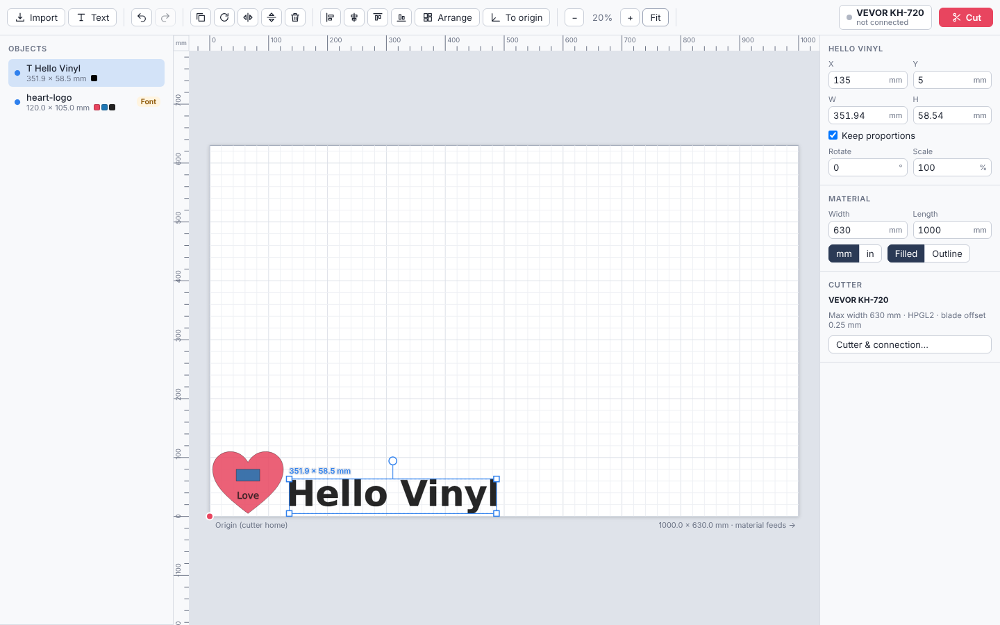

# SignCut Port

A macOS-first desktop app for vinyl cutters, built with **Tauri 2** (Rust + React). It does what you use SignCut Pro 2 for: import designs, lay them out on the material, and send them to the cutter. It uses SignCut's own machine definitions, so the same cutters work (1,616 models from 95 manufacturers, including all VEVOR models).

The main reason it exists: **fonts**. SignCut Pro 2 on macOS swaps installed custom fonts for something else when it imports an SVG. SignCut Port turns text into outlines with the exact font installed on your Mac. If a font really is missing, it tells you and lets you pick a replacement, instead of switching it silently.



## Features

### Import
- **SVG** — the full SVG feature set via `usvg`: CSS, transforms, `<use>`, shapes, `<text>` / `<tspan>` / `textPath`.
- **DXF** — lines, polylines with bulges, arcs, circles, ellipses, splines, and block inserts.
- **PLT / HPGL / DMPL** files.
- Drag and drop from Finder works.

### Fonts done right
- **Your own font library** — fonts can also be imported once (Fonts button, or drop font files on the window). They are copied into the app and available on every start, without being installed in macOS.
- **Font locations** — reads every place macOS keeps fonts:
  - system, user and network font folders, including subfolders
  - every face of a `.ttc` collection
  - **Adobe Fonts activated through Creative Cloud**
  - fonts registered through CoreText, which covers font managers such as FontBase, RightFont and Suitcase
  - legacy `.dfont` files and classic font suitcases
- **Name matching** — font names are matched the way design programs write them:
  - family names
  - PostScript names (`MyFont-BoldItalic`, as Illustrator writes them)
  - "Family Style" names (`My Font Semibold`, as Inkscape writes them)
  - CSS fallback lists, numeric weights, and italic/oblique
- **Embedded fonts** — `@font-face` fonts embedded in an SVG are used.
- **Missing fonts** — reported per object. You can choose a substitute or load the font file, then re-import.

### Text tool
Type text using any installed font, with a live preview drawn from the real glyph outlines. The size is in millimetres. Letter spacing, line height and alignment are adjustable.

### Layout
- Move, scale, rotate and mirror objects with handles, or type exact X/Y/W/H values.
- Align, auto-arrange to save material, snapping to the material edges, and move-to-origin.
- Copy, paste, duplicate, and unlimited undo.
- Rulers in mm or inches; filled or outline view.

### Cutting
- **Cutter catalog** — choose any cutter from SignCut's catalog. If SignCut Pro 2 is installed, its own `drivers.pak` is loaded automatically, so newer machines come along. You can also load a pack by hand.
- **Connections:**
  - USB-serial (`/dev/cu.*`, e.g. VEVOR/CH340), with baud, handshake and DTR settings
  - direct USB (bulk endpoint, no driver needed)
  - TCP/IP (port 9100)
  - a macOS printer queue (raw)
  - saving a `.plt` file
- **Blade:** blade-offset (drag-knife) compensation with corner swivels, and tangential emulation.
- **Cut quality:** overcut, multiple passes, and inner shapes cut first (letter counters before letters).
- **Ordering:** shortest-travel ordering, or cutting in bands along the length for long jobs.
- **Layout options:** mirror (for heat-transfer vinyl), copies stacked across the width, weeding border, and "as placed" or "at origin" placement.
- **Per colour:** turn individual colours on or off, change their order, and pause between them to swap tool or material.
- **Speed and force:** sent on models that support it.
- **Testing:** live preview with a cut-order simulation, test cut, test feed, and an option to view the raw plot data.
- **Progress:** a progress bar, and the ability to stop sending.

### Languages
- English and German (Deutsch).
- The language follows macOS by default and can be changed in the right sidebar (**Language / Sprache**).
- Numbers use the matching decimal separator (`0,25 mm` in German).
- Native dialogs follow the app language.
- Translations live in `src/locales/de.ts`, with English source strings as keys.
- `npm run check-i18n` (part of `npm run build`) fails if any string lacks a translation.

## Install (macOS)

1. Download `SignCut-Port-*-macOS-arm64.dmg` from the latest **Release**, or from the `SignCut-Port-macOS` artifact of the newest **build** workflow run.
2. Drag the app to Applications.
3. The app is not notarized, so macOS will block the first launch. Either right-click the app, choose **Open** and confirm, or run:
   ```sh
   xattr -dr com.apple.quarantine "/Applications/SignCut Port.app"
   ```

It runs natively on Apple Silicon Macs (M1 and newer), macOS 11+.

## Your first cut on a VEVOR cutter

1. **Connect the cutter by USB and switch it on.**
   - VEVOR cutters use a WCH CH340 USB-serial chip. macOS 11+ includes a driver for it, and the port appears as `/dev/cu.wchusbserial…` or `/dev/cu.usbserial…`.
   - On older macOS, install the WCH CH34x driver first.
2. **Import your SVG** (⌘I or drag & drop), or add text (⌘T). If the file uses fonts you don't have, a dialog lists them so you can fix them.
3. **Click Cut** (⌘P). Under **Cutter**, choose **VEVOR** and your exact model:
   - **KH/KI/SK** (D-board) models use the DMPL-style dialect at 9600 baud with RTS/CTS.
   - **…A / …S / …TS** (ARM-board) models use HPGL at 38400 baud.
   - These defaults come from the driver data, so you normally don't change anything.
4. **Choose the port.** Likely cutters are marked ★.
5. **Do a Test cut.** It cuts a 20 mm square with a right-angled triangle near the origin. Check that the corners are sharp and the backing isn't cut through. Also check the triangle: its right angle should be at the same corner as on screen. If it isn't, the output is mirrored or the axes are swapped.
   - Set the **blade offset** to match your blade: 45° ≈ 0.25 mm, 60° ≈ 0.5 mm. Use 0 for a pen.
   - Set the knife pressure on the cutter.
   - Rounded corners → increase the offset. Little "ears" on corners → decrease it.
6. **Cut.** For heat-transfer vinyl, tick **Mirror**.

### Orientation

The sheet is shown as it lies on the cutter:
- The **bottom-left corner** (red dot) is the cutter's home/origin. That is the front-right corner as you face a roll cutter.
- The bottom edge of the sheet is the side where the cutter's home is.
- Material feeds to the right on screen.
- **Y in the properties panel** is measured from that origin edge.

If your machine's axes come out swapped, set **Cut › Advanced › Axis order**.

## Development

Requirements:
- Rust (stable)
- Node 22
- On Linux, the Tauri system packages: `libwebkit2gtk-4.1-dev libgtk-3-dev libsoup-3.0-dev librsvg2-dev libudev-dev`

```sh
npm install
npm run tauri dev          # run the app
cargo test --workspace     # core + backend tests
npm run build              # typecheck + build UI
npx tauri build --target aarch64-apple-darwin     # macOS .app/.dmg (Apple Silicon)
```

Running `npm run dev` on its own serves the UI in a normal browser with a mock backend (`src/mock`). That's useful for UI work and screenshots.

### Layout

| Path | What |
|---|---|
| `crates/signcut-core` | Platform-neutral core library, with tests |
| `crates/signcut-core/src/fonts.rs` | Font discovery and name matching; missing-font reporting |
| `crates/signcut-core/src/import/` | SVG (usvg), DXF, HPGL/DMPL importers; text tool |
| `crates/signcut-core/src/drivers.rs` | SignCut driver XML/`.pak` model, embedded catalog (`data/machines.json`) |
| `crates/signcut-core/src/plan.rs` | Cut planning: sheet→cutter coordinates, ordering, inner-first, blade offset, overcut, passes, copies, weeding border, mirror |
| `crates/signcut-core/src/encode.rs` | Table-driven HPGL/DMPL/… output exactly as the driver defines it |
| `crates/signcut-core/src/output.rs` | Serial, USB, TCP, CUPS and file transports |
| `src-tauri/` | Tauri commands, job thread with progress, pause and cancel |
| `src/` | React UI: canvas, panels, text tool, font fixer, cut dialog |
| `docs/ANALYSIS.md` | How the original SignCut works, and what this port does differently |

To regenerate the embedded machine catalog from a SignCut installation:

```sh
cargo run -p signcut-core --example convert_drivers -- \
  "/Applications/SignCutPro2.app/Contents/Resources/drivers.pak" > crates/signcut-core/data/machines.json
```

## Not (yet) supported

These SignCut features are not in SignCut Port yet:
- PDF/AI/EPS import. Save as SVG instead; fonts are kept.
- Bitmap tracing.
- Contour cutting with registration marks (ARMS/camera).
- Tiling.
- Manual weed lines.
- Pounce and creasing.
- The SignCut Spooler.

## Notes

- SignCut is a product of SignCut AB. This project is an independent re-implementation for interoperability and is not affiliated with SignCut.
- The cutter command tables in `machines.json` were converted from SignCut's driver definitions, so that the same machines are driven the same way.
